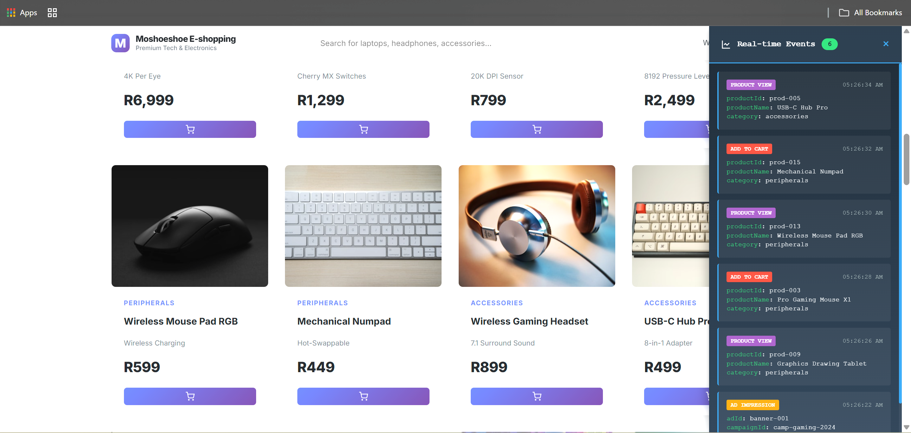
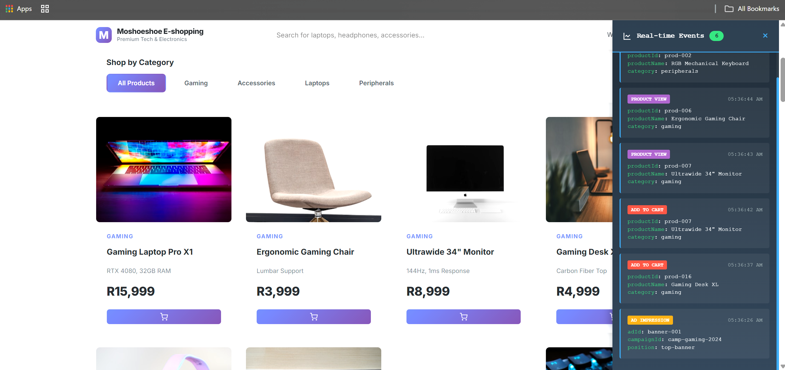
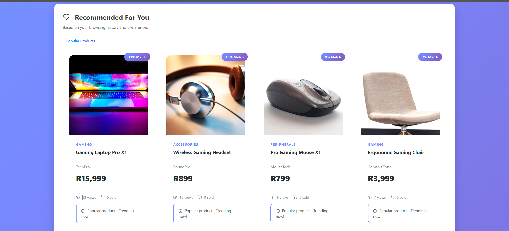
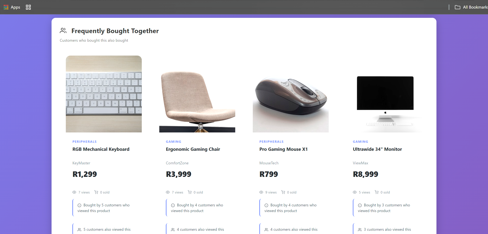

# Ad Recommendation System — Production Ready

A complete, production-grade ad recommendation platform implementing the full pipeline from user behaviour tracking to ML-powered personalised product recommendations — running live with real data.

## Screenshots

| Demo Store + Live Event Stream | Product Catalogue |
|---|---|
|  |  |

| ML-Powered "Recommended For You" | Frequently Bought Together |
|---|---|
|  |  |

> Every product card, recommendation score, and "Frequently Bought Together" result is driven by real events flowing through **Kafka → Stream Processor → PostgreSQL → Recommendation Engine** in real time.

## Architecture Overview

```
┌─────────────────────────────────────────────────────────────────┐
│                    CLIENT LAYER (Frontend)                       │
├─────────────────────────────────────────────────────────────────┤
│  1. Tracking SDK (JavaScript)                                   │
│     - Page views, clicks, searches, purchases                   │
│     - User identification & session management                  │
└────────────────┬────────────────────────────────────────────────┘
                 │
                 ▼
┌─────────────────────────────────────────────────────────────────┐
│              INGESTION LAYER (Real-time)                         │
├─────────────────────────────────────────────────────────────────┤
│  2. Event Collection API (FastAPI)                              │
│     - High-throughput event endpoint                            │
│     - Validation & enrichment                                   │
│                                                                  │
│  3. Message Queue (Apache Kafka)                                │
│     - Event streaming                                           │
│     - Topic partitioning                                        │
└────────────────┬────────────────────────────────────────────────┘
                 │
                 ▼
┌─────────────────────────────────────────────────────────────────┐
│           DATA PROCESSING LAYER (ETL)                            │
├─────────────────────────────────────────────────────────────────┤
│  4. Stream Processor (Apache Flink/Kafka Streams)               │
│     - Real-time aggregation                                     │
│     - User session management                                   │
│     - Feature engineering                                       │
│                                                                  │
│  5. Batch Processor (Apache Airflow)                            │
│     - Daily aggregations                                        │
│     - Model training pipelines                                  │
└────────────────┬────────────────────────────────────────────────┘
                 │
                 ▼
┌─────────────────────────────────────────────────────────────────┐
│              STORAGE LAYER (Data Platform)                       │
├─────────────────────────────────────────────────────────────────┤
│  6. Data Lake (MinIO/S3)                                        │
│     - Raw event storage                                         │
│     - Parquet format                                            │
│                                                                  │
│  7. Data Warehouse (PostgreSQL/TimescaleDB)                     │
│     - Processed events                                          │
│     - User profiles                                             │
│     - Product catalog                                           │
│                                                                  │
│  8. Feature Store (Redis + PostgreSQL)                          │
│     - Real-time features                                        │
│     - User embeddings                                           │
└────────────────┬────────────────────────────────────────────────┘
                 │
                 ▼
┌─────────────────────────────────────────────────────────────────┐
│           ML & RECOMMENDATION LAYER                              │
├─────────────────────────────────────────────────────────────────┤
│  9. Recommendation Engine (Python/TensorFlow)                   │
│     - Collaborative filtering                                   │
│     - Content-based filtering                                   │
│     - Hybrid models                                             │
│     - Online learning                                           │
│                                                                  │
│  10. Model Serving (TensorFlow Serving/MLflow)                  │
│     - REST API                                                  │
│     - A/B testing framework                                     │
│     - Model versioning                                          │
└────────────────┬────────────────────────────────────────────────┘
                 │
                 ▼
┌─────────────────────────────────────────────────────────────────┐
│              AD SERVING LAYER (Real-time)                        │
├─────────────────────────────────────────────────────────────────┤
│  11. Bidding Engine (Go/FastAPI)                                │
│     - Real-time bidding (RTB)                                   │
│     - Auction logic                                             │
│     - Budget management                                         │
│                                                                  │
│  12. Ad Server (FastAPI)                                        │
│     - Ad selection                                              │
│     - Creative management                                       │
│     - Impression tracking                                       │
└─────────────────────────────────────────────────────────────────┘

┌─────────────────────────────────────────────────────────────────┐
│         OBSERVABILITY & OPERATIONS                               │
├─────────────────────────────────────────────────────────────────┤
│  - Prometheus + Grafana (Metrics)                               │
│  - ELK Stack (Logging)                                          │
│  - Jaeger (Distributed Tracing)                                 │
│  - PagerDuty (Alerting)                                         │
└─────────────────────────────────────────────────────────────────┘
```

## Technology Stack

### Backend Services
- **Python 3.11+**: Core services (FastAPI, TensorFlow, PyTorch)
- **Go 1.21+**: High-performance bidding engine
- **Node.js 20+**: Tracking SDK

### Data Infrastructure
- **Apache Kafka**: Event streaming
- **Apache Flink**: Stream processing
- **Apache Airflow**: Workflow orchestration
- **PostgreSQL 15+**: Primary database
- **TimescaleDB**: Time-series data
- **Redis 7+**: Caching & feature store
- **MinIO**: Object storage (S3-compatible)

### ML & AI
- **TensorFlow 2.15+**: Deep learning models
- **PyTorch 2.1+**: Research models
- **Scikit-learn**: Classical ML
- **MLflow**: Model management
- **FAISS**: Vector similarity search

### Infrastructure
- **Docker**: Containerization
- **Kubernetes**: Orchestration
- **Helm**: Package management
- **Terraform**: Infrastructure as Code
- **GitHub Actions**: CI/CD

### Monitoring
- **Prometheus**: Metrics collection
- **Grafana**: Visualization
- **Elasticsearch**: Log aggregation
- **Jaeger**: Distributed tracing

## Project Structure

```
ad-recommendation-system/
├── services/
│   ├── tracker-sdk/              # JavaScript tracking SDK
│   ├── event-collector/          # Event ingestion API
│   ├── stream-processor/         # Real-time processing
│   ├── batch-processor/          # Batch ETL jobs
│   ├── recommendation-engine/    # ML models & training
│   ├── model-serving/            # ML inference API
│   ├── bidding-engine/           # RTB & auction logic
│   └── ad-server/                # Ad delivery
├── infrastructure/
│   ├── docker/                   # Docker configurations
│   ├── kubernetes/               # K8s manifests
│   ├── terraform/                # Cloud infrastructure
│   └── helm/                     # Helm charts
├── shared/
│   ├── proto/                    # Protobuf definitions
│   ├── schemas/                  # Data schemas
│   └── libraries/                # Shared code
├── ml/
│   ├── models/                   # Model architectures
│   ├── training/                 # Training pipelines
│   ├── evaluation/               # Model evaluation
│   └── notebooks/                # Jupyter notebooks
├── monitoring/
│   ├── dashboards/               # Grafana dashboards
│   ├── alerts/                   # Alert rules
│   └── slos/                     # SLO definitions
├── docs/
│   ├── api/                      # API documentation
│   ├── architecture/             # Architecture docs
│   └── runbooks/                 # Operations guides
└── tests/
    ├── integration/              # Integration tests
    ├── load/                     # Load testing
    └── e2e/                      # End-to-end tests
```

## Key Features

### 1. Real-time Event Tracking
- Sub-100ms event processing
- 99.99% uptime SLA
- Privacy-compliant (GDPR, POPIA, CCPA)
- Client-side and server-side tracking

### 2. Scalable Data Pipeline
- Handles millions of events/second
- Horizontal scalability
- Exactly-once processing guarantees
- Real-time and batch processing

### 3. Advanced ML Models
- **Collaborative Filtering**: User-user and item-item
- **Content-Based**: TF-IDF and neural embeddings
- **Deep Learning**: Neural collaborative filtering, transformers
- **Online Learning**: Real-time model updates
- **Multi-armed Bandits**: Exploration vs exploitation

### 4. Real-Time Bidding (RTB)
- Sub-100ms bid responses
- Budget management and pacing
- Frequency capping
- Audience targeting
- Second-price auction logic

### 5. Production-Ready Features
- **High Availability**: Multi-region deployment
- **Monitoring**: Full observability stack
- **Security**: Authentication, encryption, rate limiting
- **Privacy**: Data anonymization, consent management
- **A/B Testing**: Experimentation framework
- **Feature Flags**: Gradual rollouts

## Performance Requirements

| Metric | Target | Critical |
|--------|--------|----------|
| Event ingestion latency | < 50ms | < 100ms |
| Recommendation latency | < 20ms | < 50ms |
| Bid response time | < 50ms | < 100ms |
| System availability | 99.95% | 99.9% |
| Event processing throughput | 100K/sec | 50K/sec |

## Getting Started

### Required software
- Docker Desktop
- Docker Compose
- Python 3.11+
- Node.js 20+
- Poetry (or `python -m poetry`)

### Local demo flow

1. Start all infrastructure services (Kafka, PostgreSQL, Redis, Grafana, Jaeger, MinIO):

```powershell
docker compose up -d
```

2. Copy the environment file and start the Event Collector:

```powershell
cd services\event-collector
copy .env.example .env        # add JWT_SECRET_KEY to the .env file
poetry install --no-root
poetry run uvicorn app.main:app --host 0.0.0.0 --port 8001
```

3. Start the Stream Processor (separate terminal):

```powershell
cd services\stream-processor
poetry install --no-root
poetry run python -m app.main
```

4. Open the demo storefront:

```powershell
start services\tracker-sdk\demo.html
```

### Live service URLs

| Service | URL | Credentials |
|---|---|---|
| Demo storefront | `services/tracker-sdk/demo.html` | — |
| Recommendations page | `services/tracker-sdk/recommendations.html` | — |
| Event Collector API docs | http://localhost:8001/docs | — |
| Kafka UI | http://localhost:8081 | — |
| Grafana | http://localhost:3001 | admin / admin |
| Jaeger tracing | http://localhost:16686 | — |
| Prometheus | http://localhost:9095 | — |
| MinIO console | http://localhost:9011 | minioadmin / minioadmin |

### Key endpoints
- Event Collector: `http://localhost:8001`
- Event tracking endpoint: `http://localhost:8001/events/track`
- Demo page: `services\tracker-sdk\demo.html`

### Notes
- The `docker-compose.yml` file starts infrastructure only; app services are launched manually.
- Use the `test_pipeline.py` script to prove the full pipeline with real event ingestion and database persistence.
- If ports are already in use, stop conflicting services or change the port mappings in `docker-compose.yml`.

## Why this repo works now
- Event Collector is a FastAPI service that receives events and publishes them to Kafka.
- Stream Processor consumes Kafka events, stores them in PostgreSQL, and computes user/product features.
- The tracker demo page generates frontend events that flow through the system.
- The `test_pipeline.py` script confirms the full path from event ingestion to storage.

# Integration tests
make test-integration

# Load tests
make test-load

# End-to-end tests
make test-e2e
```

## Monitoring

### Dashboards
- **System Health**: http://localhost:3001/d/system
- **Event Pipeline**: http://localhost:3001/d/events
- **ML Performance**: http://localhost:3001/d/ml
- **Business Metrics**: http://localhost:3001/d/business

### Key Metrics
- Event ingestion rate
- Processing latency
- Model accuracy (CTR, conversion rate)
- Bid win rate
- Revenue and ROAS

## Security

- API authentication via JWT tokens
- Rate limiting on all endpoints
- Data encryption at rest and in transit
- Regular security audits
- OWASP compliance

## Privacy & Compliance

- GDPR-compliant data handling
- User consent management
- Data retention policies
- Right to deletion
- Data anonymization

## License

MIT License - See LICENSE file

## Support

- Documentation: `./docs/`
- Issues: GitHub Issues
- Slack: #ad-platform

## Contributors

Built with ❤️ for production-grade ad tech
